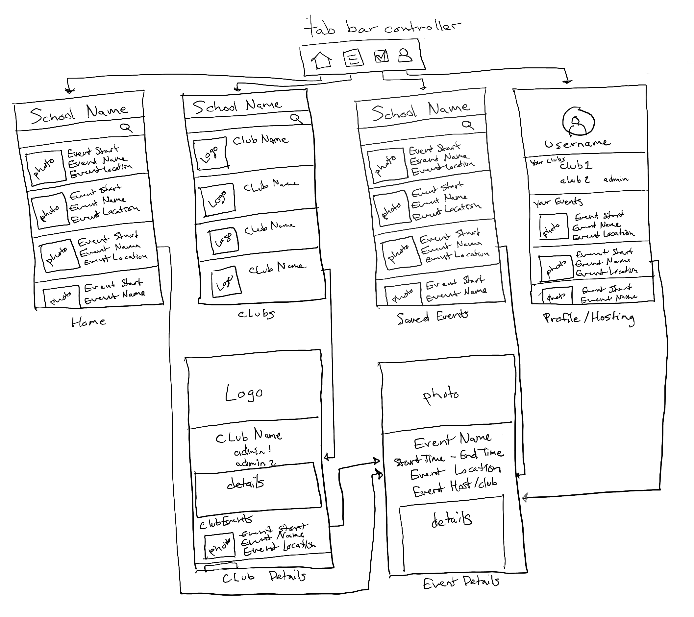

# UniEvents

## Table of Contents
1. [Overview](#Overview)
1. [Product Spec](#Product-Spec)
1. [Wireframes](#Wireframes)
2. [Schema](#Schema)

## Overview
Information hub of organizations events/meetings in a specific univeristy/college.

### Description
Allows students and student leaders of clubs and organizations to create events and post meeting information. Connects students to their peers with similar interests and allows them to find events that fit their schedule and save them to a calendar.

### App Evaluation
[Evaluation of your app across the following attributes]
- **Category:** Educational/Social Networking
- **Mobile:** This app would be primarily developed for iOS.
- **Story:** Shows university events from clubs, organizations, and individuals at the university. Students can connect to others and post comments
- **Market:** University Students. Users need a school email to register.
- **Habit:** Students can use the app as often as they want to connect to others or when they are bored and looking for events to participate in with other students.
- **Scope:** First we would start with schools that use Gmail. Then we would expand to all .edu email addresses.

## Product Spec

### 1. User Stories
#### Core features
- [] User can log in/log out
- [] User can register as student
- [] User can see the clubs they belong to 
- [] User can create/read events associated with a school or student org
- [] User can view every event past/future

#### Additional features
- [] User will see old events greyed out
- [] User can view events specific to club
- [] User can subscribe to events specific to club
- [] User can be assigned as a leaders for a club (admin)
- [] User can comment on posts
- [] User can assign admins positions is they are admin
- [] User can upload an image associated with an event if they are admin
- [] User can upload an image associated with a club if they are admin
- [] User is notified of upcoming events
- [] User can search for organizations/events

### 2. Screen Archetypes
* Login
    * User can log in/log out
* Registration 
    * User can register as student 
* Home
    * User can see all events posted for their college in chronological order 
    * User can comment on event posts
* Saved Events
    * User can view all events they have saved (as a list) in chronological order
    * User can comment on event posts
    * User can toggle saved events to be viewed in a calendar format or list format
* Hosting
    * User can view the events they are hosting
    * User can create an event
* Create Event
    * User can create an independent event associated with their school as an admin
    * User can create an event for a club or org at their school if they are an admin
    * User can upload an image associated with an event if they are an admin
    * User can select if comments are allowed if they are an admin
* Event Details
    * User can see details of an event
    * User can comment if comments are allowed
    * User can edit detail of event if they are an admin
    * User can remove a comment if they are an admin
    * User can turn off comments if they are an admin
* Clubs Page
    * User can view all the clubs at their school
    * User can join clubs
* Club Details
    * User can view all events (past/future) specific to a club
    * User can join club to subscribe to club events
    * User can contact club admin
    * User can assign admin positions if they are an admin
* Profile
    * User can view their profile image
    * User can view their username
    * User can view the clubs they belong to 
    * User can view the clubs they are an admin in
    * User can unjoin clubs they belong to
    
### 3. Navigation

**Tab Navigation** (Tab to Screen)
* Home
* Clubs Page
* Saved Events
* Profile/Hosting

**Flow Navigation** (Screen to Screen)
* Login
    * Home
* Registration
    * Home
* Home
    * Event Details
* Saved Events
    * Event Details
    * Calendar
* Profile/Hosting
    * Club Details
    * Event Details
    * Create Event
* Clubs Page
    * Club Details
* Club Details
    * Event Details
* Event Details
    * Club Details

## Wireframes


<!-- ### [BONUS] Digital Wireframes & Mockups -->

<!-- ### [BONUS] Interactive Prototype -->

## Schema 
### Models
#### Event
   | Property      | Type     | Description |
   | ------------- | -------- | ------------|
   | objectId      | String   | unique id for the event post (default field) |
   | name          | String   | name of the event |
   | author        | Pointer to User | user that created the event |
   | school        | Pointer to School | school event belongs to |
   | image         | File     | image for the event |
   | description   | String   | description of the event |
   | commentsCount | Number   | number of comments that have been posted for the event |
   | likesCount    | Number   | number of likes for the event post |
   | startTime     | DateTime | time when event starts |
   | endTime       | DateTime | time when event ends |
   | createdAt     | DateTime | date when post is created (default field) |
   | updatedAt     | DateTime | date when post is last updated (default field) |
   | link          | String   | URL for external event page |

#### User
   | Property      | Type     | Description |
   | ------------- | -------- | ------------|
   | objectId      | String   | unique id for the user (default field) |
   | username      | String   | username associated with email |
   | firstName     | String   | first name of the user |
   | lastName      | String   | last name of the user |
   | image         | File     | profile image for the user |
   | email         | String   | school email used to sign up |
   | school        | Pointer to School | school user belongs to |

#### Club
   | Property      | Type     | Description |
   | ------------- | -------- | ------------|
   | objectId      | String   | unique id for the club (default field) |
   | name          | String   | name of the club |
   | description   | String   | description of the club |
   | logo          | File     | club logo |
   | image         | File     | background image for club page |
   | email         | String   | club email |
   | school        | Pointer to School | school club belongs to |

#### School
   | Property      | Type     | Description |
   | ------------- | -------- | ------------|
   | objectId      | String   | unique id for the school (default field) |
   | name          | String   | name of the school |
   | description   | String   | description of the school |
   | logo          | File     | school logo |
   | image         | File     | school background image for student profile page |
   | email         | String   | school email |

#### Member
   | Property      | Type     | Description |
   | ------------- | -------- | ------------|
   | objectId      | String   | unique id for the club member (default field) |
   | user          | Pointer to User | user that is a member |
   | isAdmin       | Boolean  | if member can create event posts for the club |
   | createdAt     | DateTime | date when user is made a member (default field) |
   
### Networking
   - Home Feed Screen
      - (Read/GET) Query all events at user's school
         ```swift
         let query = PFQuery(className:"Event")
         query.whereKey("school", equalTo: currentSchool)
         query.order(byDescending: "startTime")
         query.findObjectsInBackground { (events: [PFObject]?, error: Error?) in
            if let error = error { 
               print(error.localizedDescription)
            } else if let posts = posts {
               print("Successfully retrieved \(events.count) events.")
           // TODO: Do something with events...
            }
         }
         ```
   - Login
      - (Read/GET) Query user object
   - Registration
      - (Create/POST) Create a new user object
   - Saved Events
      - (Read/GET) Query all events user has saved
   - Event Details
      - (Read/GET) Query event object
   - Club Details
      - (Update/PUT) Update club details
      - (Create/POST) Create a new event object
      - (Update/PUT) Update an event object
   - Profile/Hosting
      - (Read/GET) Query logged in user object
      - (Read/GET) Query all events user is hosting
      - (Create/POST) Create a new event object
   - Clubs Page
      - (Read/GET) Query all clubs at user's school

<!-- - [Create basic snippets for each Parse network request] -->
