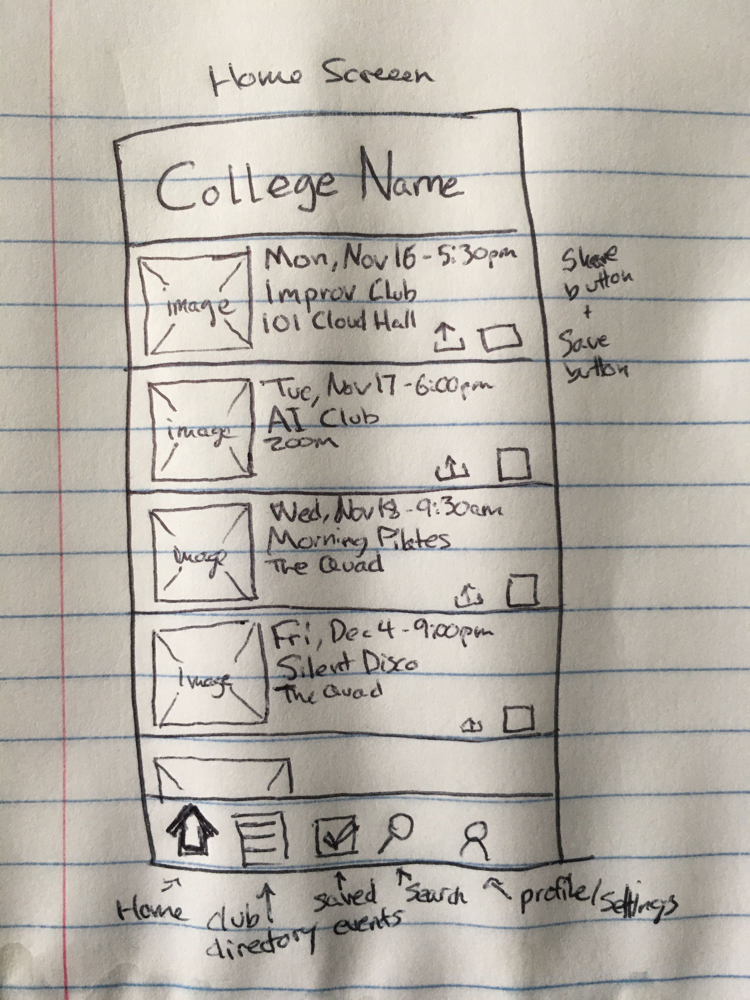

Original App Design Project - README
===

# UniEvents

## Table of Contents
1. [Overview](#Overview)
1. [Product Spec](#Product-Spec)
1. [Wireframes](#Wireframes)
2. [Schema](#Schema)

## Overview
Information hub of organizations events/meetings in a specific univeristy/college.

### Description
Allow student organizations to create events and post meeting information. Connect students to their peers and allow them to custom their student calendar by adding events that fit their schedule. 

### App Evaluation
- **Category: Educational**
- **Mobile: On the go access for students**
- **Story: With so many organizations to choose from, it is difficult to      find inforamtion regarding events/meetings. This app will hopefully allow students to gather/access information regarding student organizations all in one place**
- **Market: University Students**
- **Habit: Students can connect to others and post comments**
- **Scope: ??? Students in all Universities/Colleges**

## Product Spec

### 1. User Stories (Required and Optional)
* User can log in/log out
* User can register as student
* User can see the clubs they belong to 
* User can create/read events associated with a school or student org
* User can view every event past/future

### Optional User Stories
* User will see old events greyed out
* User can see/subscribe to events specific to club
* Users can be assigned as leaders for club (admin)
* User can comment on posts
* User can send DMs
* User can assign admins positions is they are club president/vice
* User can upload an image associated with an event/club if admin?
* User can search for organizations/events

### 2. Screen Archetypes
* Login
    * User can log in/log out
* Registration 
   * User can register as student 
   * User can assign admins positions is they are club president/vice
* Feed
    * User can see all events in chronological order 
* Profile
    * User can see the clubs they belong to
    * User profile info is gated based on other user's permission 
    * User profile info is available to user themselves
* Create
    * User can subscribe to events specific to club
    * User can create events associated with a school or student org
    * User can comment on posts
    * User can RSVP to different events
* Details
    * User can see to events specific to club
    * User can view every event past/future
### 3. Navigation

**Tab Navigation** (Tab to Screen)

* Home page
* Profile
* Club Directory
* Saved Events
* Student calendar/Event calendar
* Organization page

**Flow Navigation** (Screen to Screen)

* Login/Registration
    * Home feed
* Home Tabs
    * Home feed
* Event details
    * Calendar
    * Profile
    * Organization Page

## Wireframes

### [BONUS] Digital Wireframes & Mockups

### [BONUS] Interactive Prototype

## Schema 
### Models
#### Event
   | Property      | Type     | Description |
   | ------------- | -------- | ------------|
   | objectId      | String   | unique id for the event post (default field) |
   | name          | String   | name of the event |
   | author        | Pointer to User | user that created the event |
   | image         | File     | image for the event |
   | description   | String   | description of the event |
   | commentsCount | Number   | number of comments that have been posted for the event |
   | likesCount    | Number   | number of likes for the event post |
   | startTime     | DateTime | time when event starts |
   | endTime       | DateTime | time when event ends |
   | createdAt     | DateTime | date when post is created (default field) |
   | updatedAt     | DateTime | date when post is last updated (default field) |
   | link          | String   | URL for external event page |

#### User
   | Property      | Type     | Description |
   | ------------- | -------- | ------------|
   | objectId      | String   | unique id for the user (default field) |
   | username      | String   | username associated with email |
   | firstName     | String   | first name of the user |
   | lastName      | String   | last name of the user |
   | image         | File     | profile image for the user |
   | email         | String   | school email used to sign up |
   | school        | String   | school provided in email address |

#### Club
   | Property      | Type     | Description |
   | ------------- | -------- | ------------|
   | objectId      | String   | unique id for the club (default field) |
   | name          | String   | name of the club |
   | description   | String   | description of the club |
   | logo          | File     | club logo |
   | image         | File     | background image for club page |
   | email         | String   | club email |
   | school        | String   | school club belongs to |

#### Member
   | Property      | Type     | Description |
   | ------------- | -------- | ------------|
   | objectId      | String   | unique id for the club member (default field) |
   | user          | Pointer to User | user that is a memeber |
   | isAdmin       | Boolean  |
   | createdAt     | DateTime | date when user is made a member (default field) |
   
### Networking
- [Add list of network requests by screen ]
- [Create basic snippets for each Parse network request]
- [OPTIONAL: List endpoints if using existing API such as Yelp]